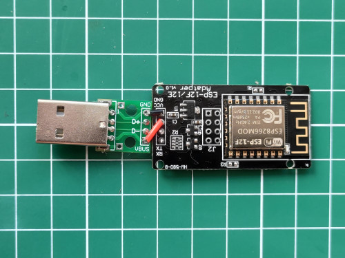
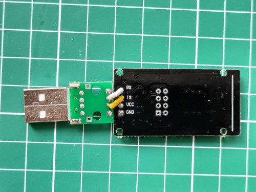

# Prototyping

I have used WiFi serial adapters from [aliexpress](https://aliexpress.ru/item/32815395082.html).

## Variant 1

## Variant 2

# Links
 -  [WiFi serial adapter witn ESP-12F](https://aliexpress.ru/item/32815395082.html)
 -  [WiFi serial adapter witn ESP-01](https://aliexpress.ru/item/32897629868.html)
 -  [JST XH 2.54mm 4-Pin Pig-Tail Cable](https://aliexpress.ru/item/32954418743.html) for variant 1
 -  [USB connector](https://aliexpress.ru/item/33046165874.html) for variant 2  
