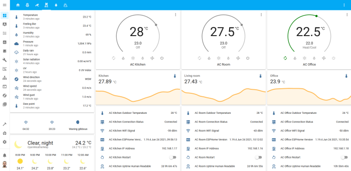

# Midea mini dongle

This is the Midea mini dongle - USB stick for air conditioners controlled by the Midea UART protocol.

This repository contains a schematic and PCB layout for a Midea mini dongle.

### Some credits before start

Thanks to [Sergey V. Dudanov](https://github.com/dudanov) who created an excelent [midea_ac](https://esphome.io/components/climate/midea_ac.html) component for ESPHome that integrates midea-like aircondititioners with Home Assistant.

Schematics are based on manufacturers datasheets but some component values come from [Adafruit Learning System](https://learn.adafruit.com/) so thanks to Adafruit for keeping their products open source.

## Idea

Small dongle with minimum components and fully assembled by PCB manufacturing service in standard case.

### Prototyping

Make prototypes with a ready modules and found that midea_ac is very usefull and have stable result. 

If you want to make your own with cheap modules please read [this](PROTOTYPING.md).  

## Schematic

This is the schematic of Midea mini dongle

Download pdf file [Schematic_midea-mini-dongle.pdf](Schematic_midea-mini-dongle.pdf)
## PCB 

Dimensions: 
 - Width x Height: 44x20mm
 - USB connector: +15mm 
 - Overall: 59x20mm
 - Thickness: 0.8mm

### 2D View

### 3D View

### Case

PCB is designed for [Gainta G1901 case](datasheets/case.pdf)

## Ordering and manufacturing

 - Gerber files: [Gerber_pcb-midea-mini-dongle-v1.3_2021-05-14.zip](jlcpcb/Gerber_pcb-midea-mini-dongle-v1.3_2021-05-14.zip)
 - BOM file: [BOM_pcb-midea-mini-dongle-v1.3_2021-05-14.csv](jlcpcb/BOM_pcb-midea-mini-dongle-v1.3_2021-05-14.csv)
 - CPL file: [PickAndPlace_pcb-midea-mini-dongle-v1.3_2021-05-14.csv](jlcpcb/PickAndPlace_pcb-midea-mini-dongle-v1.3_2021-05-14.csv)

## Hardware

Dongles manufactured and fully assembled by JLCPCB

PCB and the case 

 

## Firmware

You may use [simple config](midea_ac.yaml) or create your own one following the instructions on the [ESPHome website](https://esphome.io/components/climate/midea_ac.html).

### Flashing
Please read [flashing manual](FLASHING.md)

## Installing

### Dashboard

## Resources
 - [midea_ac component for ESPHome](https://esphome.io/components/climate/midea_ac.html) 
 - [midea-open-dongle](https://github.com/dudanov/midea-open-dongle)
 - [Midea HVAC WiFi Dongle](https://github.com/reneklootwijk/mideahvac-dongle)
